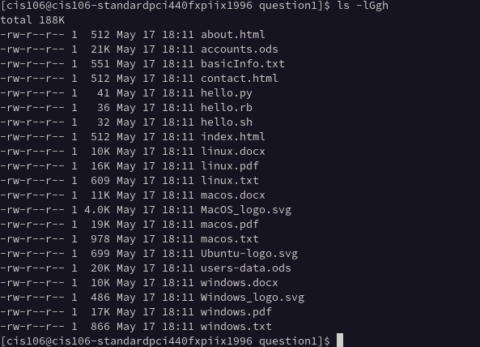
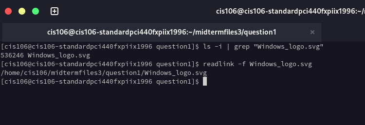
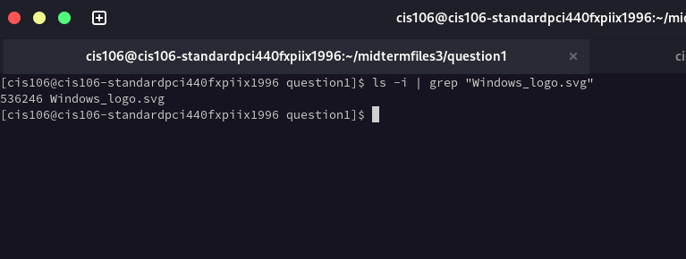
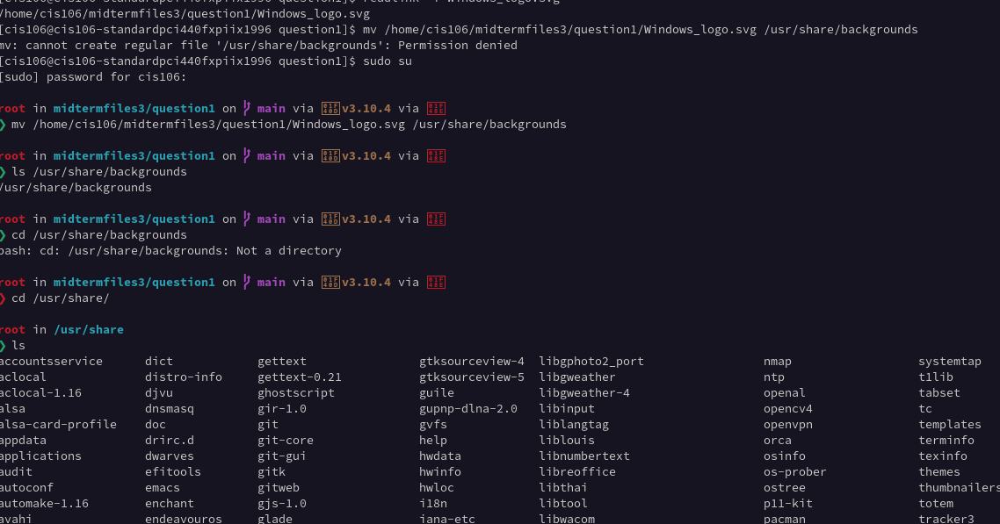
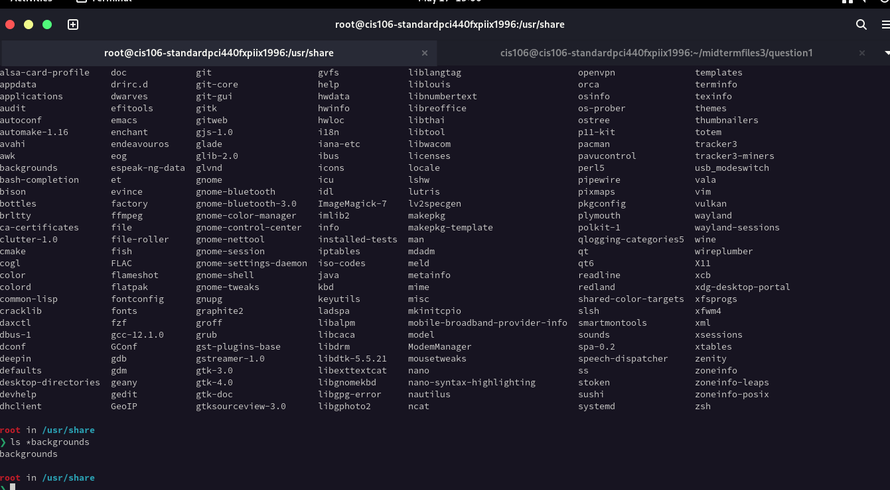

### Question 1 

### Question 2 

### Question 3

### Question 4
1. What is the Absolute path of the image you picked?
  
2. What is the inode number of the image you picked?

3. Which command would you use to move the file from its current location to the
/usr/share/backgrounds directory and rename it at the same time? Make sure to include the
whole command. This must be done in a single command.

1. What command would you use to know the size of every image in the ~/midtermfiles3/question1
directory, including their permissions, and the full date of the last time it was modified?

4. Which command would you use to get this output of the ~/midtermfiles3/question1 directory. Include
the whole command that will give you this output.