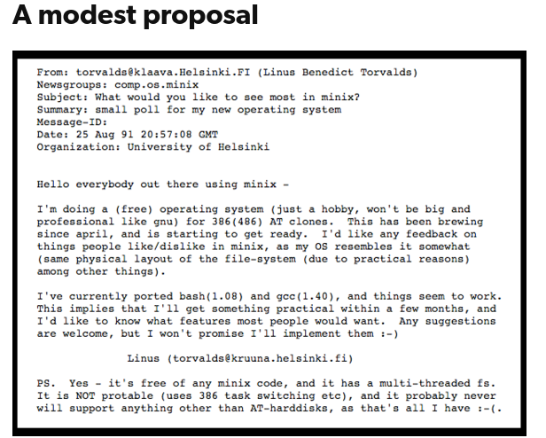

# Deliverable1

##    Introduction
* I'm going to talk about how to use Endeavour os in daily life as your primary operating system Endeavour os is an active system based on Arch Linux distribution. Witch the difference from ubuntu that has deb package in an arch all can be compiled, and can be precompile even is not from their package manager. They are trying to sol the problem. With ubuntu distribution, packages take a long time to release in Endeavor or any other arch-based distro. This fact does not happen since these arch base distributions have the most recent updates of everything.
  
##    Project hardware and software requirements
* Processor 1ghz minimum intel or amd.
# Ram:
* Gnome – A minimum of 4GB of RAM is necessary 
* 10 gbs minimum of disk
  
##  What is Linux?

 * Just like windows os and mac os Linux is an operating system. Still, with the difference that it is open compared to mac os and windows os since it is available to the user, so the user can see the source code and modified at will, also distributed to anyone at 0 costs. Meanwhile, their homologue has a price for a license and controls the hardware and software the same way or better since communities or people around the globe can fix problems quickly and more efficiently than Microsoft or apple. 

###    Short history of linux

* A message sends from Linux Torvalds to the Minix community across the world. Describing what he has until that moment and accepting some suggestions, but he doesn't promise anything, yep, and with this start 25 years of a beautiful operating system.

### Linux distribution

* **Slackware**: It is a Gnu/Linux distribution, but with the ability to change it as you want without a graphical environment to enable or disable services at will is also accessible for any dependencies problems since it uses the kiss principle.
  
* **Debian**:  is a particular distribution of the Linux operating system, and numerous packages that run on it. 

> **Debian base linux distributions**
> Ubuntu: is a complete Linux operating system, freely available with both community and professional support. The Ubuntu community is built on the ideas enshrined in the Ubuntu Manifesto: that software should be available free of charge, that software tools should be usable by people in their local language and despite any disabilities, and that people should have the freedom to customize and alter their software in whatever way they see fit. 

> Kali Linux: is an open-source, Debian-base  Linux distribution aimed at advanced penetration testing and security Auditing.

* Red Hat Enterprise Linux:
>Fedora: is a Linux distribution developed by Fedora project sponsored by redhat and Ibm, giving support for companies and organizations.

##        Open Source VS Closed Source

* Open source is software with source code  anyone can inspect, modify, and enhance; it also can be distributed to anyone. Also, all the pieces of the software can be changed and be manipulated. As a result, programmers can improve its features or fix parts that don't always work correctly.

* The close source is software not free, where the source code is encrypted, and no one can see the code, only developers, and it pays as you get one product you have it but can't be modified by any third party and can not be widely distributed. 

### Advantages of open source

* Any one can change it.
* lesser hardware cost.
* High-quality software.
* No vendor lock-in.
* Integrated management.
* Simple license management.
* Lower software costs.
* Abundant support. 
* scaling and consolidating.

### Advantages of closed source

* User Friendly
* Security
* Support
* Testing
* Updates
* Troubleshooting

## The Free software movement

* The free software movement is a social movement with the goal of obtaining and guaranteed certains freedoms for users.Namely freedoms to run software, to modify the software, and to share copies of the software.  

* Richard Stallman is an American free software movement activist and programmer. He is also a pioneer of copyleft, which led to many developers' use in free software foundations. Also, he has been the co-founder of the league for programming freedom since the 1990s. 

* Freedoms: 
* The freedom to run the program as you wish, for any purpose (freedom 0): This means that you have the right to run any kind of program you want to run without the need to say anything to the developer or any entity. And can be distributed and used by many people for their purposes, and you cant not impose your purpose on the person that downloaded it.
  
* The freedom to study how the program works, and change it so it does your computing as you wish (freedom 1). Access to the source code is a precondition for this: Is the ability to see and edit the source code as you want it and knows how it works also deleted if you're going to see how the program works. 
* The freedom to redistribute copies so you can help others (freedom 2): means that you can distribute copies either paying or for free for distribution to any one any where.
* The freedom to distribute copies of your modified versions to others (freedom 3). By doing this you can give the whole community a chance to benefit from your changes. Access to the source code is a precondition for this: this means that any one can change it and be able to read the source code even it is in binary.

  
## sources

* Hardware requirements: https://itsfoss.com/endeavouros-vs-manjaro/ 
* What is linux: https://www.linux.com/what-is-linux/
* slackware: https://book.huihoo.com/slackware-linux-basics/html/introduction.html
* Debian : https://www.debian.org/doc/manuals/debian-faq/basic-defs.en.html
* ubuntu : https://help.ubuntu.com/lts/installation-guide/s390x/ch01s01.html
* Kali linux: https://www.kali.org/docs/introduction/what-is-kali-linux/
* Fedora: https://en.wikipedia.org/wiki/Fedora_Linux
* Open source: https://opensource.com/resources/what-open-source
* close source: https://cyberhoot.com/cybrary/closed-source/
* Advantage of open source: https://www.outsource2india.com/software/articles/open-source-software.asp
* Advantage of close source:  https://www.hitechwhizz.com/2021/05/6-advantages-and-disadvantages-drawbacks-benefits-of-closed-source-software.html
* The-free-software-Movement: https://en.wikipedia.org/wiki/Free_software_movement 
* Richard stallman: https://en.wikipedia.org/wiki/Richard_Stallman
* The-four-freedoms: https://www.gnu.org/philosophy/free-sw.html#four-freedoms
  