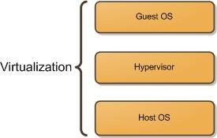
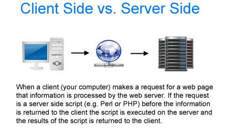
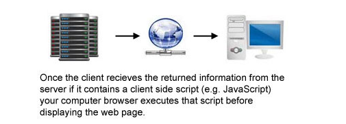
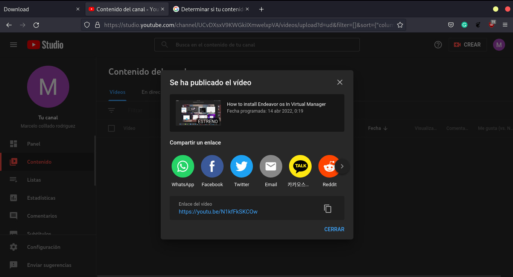

### What is Virtualization?

  *    Virtualization is running a computer inside another computer, but with a difference. The computer running in the virtual machine has a low risk of damage or loss if you break it. A virtual machine can also make it instantly without the worry of getting stolen on the internet because virtual machines are always used for general purposes in case of loss. So you only delete it and create a new one. Furthermore, a virtual machine can store it in remote sources like servers that are computers. The main reason to exist is only to save and store data of any network or user worldwide.



### Types of virtualization


* **Client-side Virtualization** IS a Virtual machine, but with the differences that are the focus in use with users only with applications. For example, suppose you use your phone daily, and that phone uses an application, you. In that case, the regular user doesn't have access to the server. Instead, you have access to the server, a computer that stores information on the net, to access an application. So your phone as a cloud gaming app like Nvidia cloud or Xbox cloud from your phone, and use the resources. From the server using the app like memory ram, etc. but can't modify what is shown to you. You can't install anything or use anything that the server owner does not predetermine.
  
  
  
*  **Server-side Virtualization** IS the technique of transforming one powerful computer into a machine that stores data and use it from just one device to avoid the excess power consumption and hardware overcrowding do it, but the excessive amount of racks or spaces that need for this task also is not the best idea since server virtualization tends to use the hardware or physical components of a machine and share with all the others virtual servers going to be overwhelming at some point still have many advantages since you can use as regular Server and modified as much as you need it 



### Hypervisor 

* Hypervisor is software that creates also manages virtual machines (Vms). The hypervisor allows a computer to run multiple virtual computers using the same resources as the host computer. Also, these VMS acts as independent computers or servers that control apps as a regular computer does. Hypervisors also use the same memory and configuration from the shot. Still, they can be variable, not the same as the host since it can use the hypervisor to do specific tasks. Such as turning on a machine that makes products or cars or even an ATM that typically uses hypervisors.

### Types of hypervisors
* Type 1: are commonly called Bare metal or native if anything runs natively in your computer. You don't even realize it is not meant to work on the computer, but it works perfectly. You don't even notice type 1 hypervisors not only run as is they told to create for that os but also manage the host's resource in a way that is in a form using a real computer with that hardware mounted. Type 1 bare-metal hypervisors support highly scalable virtualization because they run directly on the hardware layer, often embedded in firmware. Additional terms for Type 1 are native or embedded hypervisors because of their hardware location.

* Type 2: are the one that we know as regular virtual machines but type 2 are dependent of the host to do anything mean while type 1 not need any hypervisor like a must can work separately from it type 2 runs virtual machines in a virtual layer.Type 2 hosted hypervisors perform software virtualization. They run as a software application on top of a host OS, and are more like installed applications than hardware-based Type 1. Most Type 2 users take advantage of this simpler hypervisor to run VMs on a single computer without the complex deployment and management requirements of a Type 1.
  
## Virtual Manager

* Virtual Manager or virtual-manager is a graphical front-end hypervisor that supports different types of virtualization such as Qemu, Zen, and Xen used in Linux and Windows. Its primary purpose is to virtualize a virtual machine making it. It is easy to use without going into the terminal using a graphical interface that makes the user install it and manage it easily.
  


## Installing Endeavour os  in Virtual  Manager

* Installing Endeavour os is a process that takes several steps First one is installing and configure Libvirt and Qemu. 

* 1. Installing all the packages to run virt-manager.

Basic install:

```sudo pacman -S virt-manager libvirt qemu```

Full-featured install:

```sudo pacman -S --needed virt-manager qemu libvirt edk2-ovmf dnsmasq vde2 bridge-utils openbsd-netcat iptables-nft dmidecode```


2. After installation completes you need to enable libvirtd service.

```sudo systemctl enable --now libvirtd.service```

3. Check for the status to make sure the service is running.

```systemctl status libvirtd.service```

The output should look something like below.

○ libvirtd. service - Virtualization daemon
     Loaded: loaded (/usr/lib/systemd/system/libvirtd.service; enabled; vendor preset: disabled)
     Active: inactive (dead) since Tue 2021-08-31 20:33:58 +0530; 1h 14min ago
TriggeredBy: ● libvirtd-admin.socket
             ● libvirtd-ro.socket
             ● libvirtd.socket
       Docs: man:libvirtd(8)
             https://libvirt.org
    Process: 21412 ExecStart=/usr/bin/libvirtd $LIBVIRTD_ARGS (code=exited, status=0/SUCCESS)
   Main PID: 21412 (code=exited, status=0/SUCCESS)
      Tasks: 2 (limit: 32768)
     Memory: 18.5M
        CPU: 423ms
     CGroup: /system.slice/libvirtd.service
             ├─982 /usr/bin/dnsmasq --conf-file=/var/lib/libvirt/dnsmasq/default.conf --leasefile-ro --dhcp-script=/usr/lib/libvirt/libvirt_leaseshelper
             └─983 /usr/bin/dnsmasq --conf-file=/var/lib/libvirt/dnsmasq/default.conf --leasefile-ro --dhcp-script=/usr/lib/libvirt/libvirt_leaseshelper
To use our normal user without entering the root password we need to configure KVM to enable it. This will also enable the libvirt networking components as well without doing this it won’t work.
You need to open the libvirt configuration file located at /etc/libvirt/libvirtd.conf. To open you can use your favorite text editor (vi, vim, or nano).
sudo nano /etc/libvirt/libvirtd.conf
Now we need to set UNIX domain socket ownership to libvirt. Scroll down till you see the below line and uncomment it.
unix_sock_group = 'libvirt'
Let’s set the UNIX socket permission to R/W. Scroll down till you see the below line and uncomment it.
unix_sock_rw_perms = '0770'
Add your user account to the libvirt group.
sudo usermod -a -G libvirt $(whoami) or sudo usermod -a -G libvirt (your user name)
– `whoami` is a function that put the current user name in the placeholder
Now we need to add our user to `qemu.conf`. Otherwise, QEMU will give a `permission denied` error when trying to access local drives. You can use your favourite text editor to edit the file.
sudo nano /etc/libvirt/qemu.conf
Scroll down or search for `user = “root”` or `group = “root”`. Then uncomment both entries and change the root to your user name or ID and then save and exit. Once edited it should look something like below.

4. You could restart your service, but it’s best to reboot the entire system.

```sudo shutdown -r now```


Network:
If Network is disabled after rebooting the host machine and you do not find a way to enable it, you can have it enabled per default from the command line. This will work after rebooting the host:

```sudo virsh net-autostart default```


5. after this you need to Download the iso file from endeavour page and start the installation as regularly you do in a virtual machine 



Link in the source Down Below

### Updating Endeavour os 

```sudo pacman -Syyu```

* sudo is for getting user privilege need it for give the necessary permissions to run the command
* Pacman is the package manage using by Endeavour os that is base on arch linux
* -Syyu is the command part use to say to pacman hey updates the system and synchronize everything with official repos of Endeavour os.


### Installing Software in Endeavour os

* Installation command examples
  ```sudo pacman -S packagename``` or aur helper in my case yay ```yay package name``` plus number of the package you want aur helper search from repo and give you choose to there download a package. ```yay qemu``` and  ```sudo pacman -S qemu``` 

* Searching for software
  ```sudo pacman -Ss package_name``` or aur yay ```yay name of the package``` 
* Deleting software
  ```sudo pacman -R package_name```
  ```sudo pacman -R  anbox```

### Basic linux Commands
Updating the system
EndeavourOS is a rolling release distro based on Arch Linux. This means your system always receives the latest packages, so you’re always ensured of an up-to-date system without installing a major release once or twice a year.

To update the system you can use this command

```sudo pacman -Syu```

You will notice that Arch releases updates daily and we strongly recommend doing a full system update instead of a partial one, so install updates at a time in the day you’re able to read and look upon the updates on our forum, so not when you’re thirty minutes from an important presentation.

The community often warns you if an update is broken, so you know it’s better to wait to perform the update, with big issues, Arch usually fixes those within hours. You can also install the updates once a week and keep an eye out on the forum every day to keep yourself informed. Don’t delay installing the updates longer than that, because this can break your system.

Searching for packages
To search for packages in Pacman you can use the command

```pacman -Ss package_name```
When you’ve found the package you can install it according to the instructions in the paragraph here below.

When you can’t find the desired package, this means it isn’t in the Arch repo, but you’ll find it most likely in the AUR. For searching and installing packages in the AUR we refer to the yay article.

Installing packages
To install a single package from the Arch repository you can use the following command in the terminal.

```sudo pacman -S package_name```
You can also use this command to install several packages by just hitting the space bar after the first package name and enter the other package name(s).

Installing package groups.
Suppose, you have read on our forum or on the internet an article or review of a Desktop Environment that has caught your interest. Instead of installing all the separate packages that the DE depends on, you can also install the entire group by the following style of command

```sudo pacman -S plasma```
This installs all the packages that belong to the DE, in this case, I used KDE plasma as an example, just replace plasma with the DE you wish to install. You will notice that Pacman first displays all the packages and asks for your permission to install them. If you want to exclude packages from the DE group you can do so by the following.

Enter a selection (default=all): 1-15 20
In this case it will install packages 1 through 15 and package number 20.

Enter a selection (default=all): ^5-8 ^15
This will install everything that belongs to the DE group, except packages 5 through 8 and package number 15.

Removing packages
A package is always installed with other packages that it depends on, called dependencies. Quite often those dependencies are already, or partially installed on your system because other packages also depend on it.

To remove a package without the dependencies use the following command.

```sudo pacman -R package_name```
If you rather want to avoid a cluttered system you can remove a package and its dependencies, without removing dependencies that are used by other installed packages, use the following command.

```sudo pacman -Rs package_name```
Refreshing mirrors
Sometimes it can happen that your system can’t find the updates or packages in the Arch repo. In that case, it could be that there’s a problem with the mirrors you’re trying to connect to. You can simply refresh the mirrors with this command

```sudo pacman -Syyu```

Skipping package updates
Although we do not recommend partially update your system, sometimes it is needed, because there’s a problem with the updated package upstream and Pacman isn’t able to perform the daily or weekly update, because of this certain package or the specific package causes to break the system. In that case, you can put that package on the Ignore list.

sudo nano /etc/pacman.conf
Ad the line IgnorePkg = package_name like this.

# Pacman won't upgrade packages listed in IgnorePkg and members of IgnoreGroup
 #IgnorePkg =
 IgnorePkg = package_name
 #IgnoreGroup =
Save and close the file by hitting ctrl + o and then ctrl+x

In this case, Pacman will always inform you that there’s an update for a certain package on the Ignore list like this.

:: package_name is in IgnorePkg/IgnoreGroup. Install anyway? [Y/n]
You can also put an entire group on the ignore list by adding the line IgnoreGroup = gnome

To remove the package or group from the ignore list just open the file as described above and remove the added lines, save and close the file, then type the following command.

sudo pacman -S package_name
The above method will permanently stop the specified package from being upgraded until you remove it from the ignore list

To do this temporarily, you can simply run:

```sudo pacman -Syu --ignore=package_name```
This command will skip the package from being updated. Similarly, to skip a package group, just run:

```sudo pacman -Syu --ignoregroup=gnome```


### Navigating the filesystem

Same here

### Managing files and directories

#### Mkdir

* Description: Create the DIRECTORY, if they do not already exist.
* Usage: ```mkdir directory_name```
* Examples: ```mkdir projects``` or ```mkdir avellanas```  or ```mkdir -P florero```


#### cp

* Description: short for copy, copies a file from one file location to another. Unlike the move command, the cp command retains the original file in its current location and makes a duplicate copy in a different directory.
  
* Usage: cp /file/path /destination/path
* Examples: ```cp anemona.txt Home/Downloads```, ```cp game-of-thrones--chapter1.mp3 Videos/Downloads```


#####


### Sources

* Endeavour os Wiki: https://discovery.endeavouros.com/applications/how-to-install-virt-manager-complete-edition/2021/09/

* Virtualization Basics: https://www.cnblogs.com/popsuper1982/p/3800230.html

* computer hope: https://www.computerhope.com/jargon/s/server-side-scripting.htm

* How to install Endeavour os : https://youtu.be/N1kfFkSKCOw

* Hypervisor : https://www.serverwatch.com/virtualization/hypervisor-server/

* Basic commands of Endeavour os : https://discovery.endeavouros.com/pacman/pacman-basic-commands/2021/03/