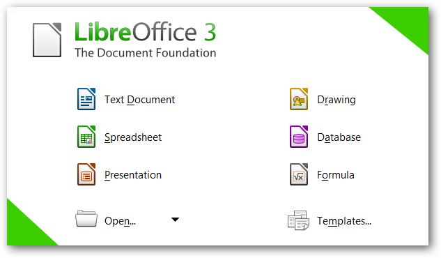

###  Connecting Endeavour os to the internet


    * Open the system menu from the right side of the top bar.

    * Select Wi-Fi Not Connected. The Wi-Fi section of the menu will expand.

    Click Select Network.

    * Click the name of the network you want, then click Connect.

    * If the name of the network is not shown, scroll down the list. If you still do not see the network, you may be out of range, or the network might be hidden.

    * If the network is protected by a password (encryption key), enter the password when prompted and click Connect.

    * If you do not know the key, it may be written on the underside of the wireless router or base station, or in its instruction manual, or you may have to ask the person who administers the wireless network.

    * The network icon will change appearance as the computer attempts to connect to the network.

    * If the connection is successful, the icon will change to a dot with several curved bars above it (). More bars indicate a stronger connection to the network. Fewer bars mean the connection is weaker and might not be very reliable.

    * You can just follow those steps above is similar to ubuntu just using ENDEVOUR OS.


  [](https://youtu.be/AFwpYXWYGVo "Performing Daily Task in Endevour os Part1")


 ## Every day tasks In Endeavour os:

* Internet browsing I have 2 browsers chromium and firefox. Video in the description below explaining it

### Firefox


* The Firefox Browser is the only major browser backed by a not-for-profit that doesn’t sell your personal data to advertisers while helping you protect your personal information. Learn more about the Firefox Browsers and other products.

### Alternatives

### Chromium


Chromium OS is a free and open-source operating system designed for running web applications and browsing the World Wide Web. It is the open-source version of Chrome OS, a Linux-based operating system made by Google.

Like Chrome OS, Chromium OS is based on the Linux kernel, but its principal user interface is the Chromium web browser rather than the Google Chrome browser. Chromium OS also includes the Portage package manager, which was originally developed for Gentoo Linux. Because Chromium OS and Chrome OS use a web browser engine for the user interface, they are oriented toward web applications rather than desktop applications or mobile apps.

Google first published the Chromium OS source code in late 2009. 

  [](https://youtu.be/AFwpYXWYGVo "Performing Daily Task in Endevour os Part1")

[](https://youtu.be/jKfBHya3DTE "Performing Daily Task in Endevour os Part2")

#### Reading email 

* I read it on the Browser always on the browser I use always firefox

[](https://youtu.be/E0S7ta6maKM "Performing Daily Task in Endevour os Part3")

            
### Remote assistance
  
### Teamviewer 


* TeamViewer is without a doubt one of the best remote desktop software programs on the market. It enables users to access devices remotely, providing support or controlling said devices from a different location.
  
  [](https://youtu.be/E0S7ta6maKM "Performing Daily Task in Endevour os Part3")

### Office productivity (writing documents(Libre office Write), editing spreadsheets(libre office cal spreadsheets) and doing presentations(Libre office impress presentations))

### Libre Office suite




* LibreOffice is a free Microsoft Office alternative, complete with spreadsheet program, database tool, presentation maker, and word processor. With support for the major file types used by corresponding MS Office programs Excel, Access, PowerPoint, and Word, this free office suite should fulfill the needs of most users. 


[](https://youtu.be/e8Kp-KttweI "Performing Daily Task in Endevour os Part4")


[](https://youtu.be/X_qSvbDW2Cc "Performing Daily Task in Endevour os Part4.2")

[](https://youtu.be/aTm_Ji11isw "Performing Daily Task in Endevour os Part4.2.1")
  
### Streaming music and video
 
### Hulu 


Hulu is an on-demand video streaming platform that has been around for more than a decade. It’s one of the best and largest streaming platforms in the United States, with more than 40 million subscribers.

### Cinder or apple music


An open source and community oriented Apple Music client for Windows, Linux, macOS, and more.

### Apple music


(Pocket-lint) - Apple Music is a subscription-based music streaming service, like Spotify, offering access to over 90 million songs.

It's packed with features, including offline listening for when you're not connected, and it combines all your music in one place - even songs ripped from a CD. Apple Music also offers up live radio stations and integration with Siri so you can control most things with voice commands.


[](https://youtu.be/NhwUkCtTaJ0 "Performing Daily Task in Endevour os Part5")


### Video games  

### Steam


* Steam is the ultimate destination for playing, discussing, and creating games.

* How to install it using aur helper in terminal ```yay steam```
### Lutris 


* Lutris is a video game preservation platform aiming to keep your video game collection up and running for the years to come.
Over the years, video games have gone through many different hardware and software platforms. By offering the best software available to run your games, Lutris makes it easy to run all your games, old and new. 


### Nvidia  Geforce now 


* GeForce NOW is NVIDIA’s cloud-based game streaming service, delivering real-time gameplay straight from the cloud to your laptop, desktop, Mac, SHIELD TV, iPhone, iPad, and Android devices. Connect to your store accounts and stream your own library of games, or play your favorite free-to-play games. With cloud saves for supported games, you can pick up your game where you left off, on any supported device, wherever you are.
  

[](https://youtu.be/NhwUkCtTaJ0 "Performing Daily Task in Endevour os Part5")

### Video Chatting/calling/conferencing  
  
  ### Zoom 


 Zoom is an online audio and web conferencing platform. People use it to make phone calls or to participate in video conference meetings.

It was founded in 2011 by Eric Yuan, a former Cisco executive. Cisco offered the WebEx web conferencing platform, which remains a competitor in the conferencing space today. Yuan's competitor, Zoom, evolved quickly; the service launched in 2013 and had a million users by the end of the year. 


### Texting/Instant messaging

### Whatsapp web


* WhatsApp Web is an online platform for using your WhatsApp account on your computer. It allows you to chat with people in WhatsApp on your computer, rather than on your phone.

WhatsApp Web is an extension of the WhatsApp mobile application. Because of this, WhatsApp must be installed on your phone before you can use WhatsApp Web. You log in by using your phone to scan a QR code on your computer. This syncs your contacts and messages, effectively mirroring WhatsApp, so that what you do in WhatsApp Web happens on your phone, and vice versa.

### Telegram


* Telegram is a multi-platform messaging service founded by Russian entrepreneur Pavel Durov. It first rolled out on iOS and Android in late 2013, and now has an estimated 550 million monthly users. Telegram’s user base tends to increase whenever a privacy scandal hits one of its larger competitors. 

* Telegram’s core functionality is the same as most other messaging apps: You can message other Telegram users, create group conversations, call contacts, make video calls, and send files and stickers. However, there are a few specific features that make it work differently from other chat apps.

### Programing

### Visual studio code


* Visual Studio Code is a streamlined code editor with support for development operations like debugging, task running, and version control. It aims to provide just the tools a developer needs for a quick code-build-debug cycle and leaves more complex workflows to fuller featured IDEs, such as Visual Studio IDE.

* How to install it Just downloads the snap and follow the instructions for your distribution 
* https://snapcraft.io/code 

### Monodevelop 

 

* MonoDevelop (also known as Xamarin Studio) was an open-source integrated development environment for Linux, macOS, and Windows. Its primary focus is development of projects that use Mono and .NET Framework. MonoDevelop integrates features similar to those of NetBeans and Microsoft Visual Studio, such as automatic code completion, source control, a graphical user interface (GUI) and Web designer. MonoDevelop integrates a Gtk# GUI designer called Stetic. It supports Boo, C, C++, C#, CIL, D, F#, Java, Oxygene, Vala, JavaScript, TypeScript and Visual Basic.NET.  


* How to install is you can fin more information in monodevelop page here: https://www.monodevelop.com/download/


  ### Educational Applications (dictionaries and that kind of stuff)

### celestia 


* Celestia is a 3D astronomy software program created by Chris Laurel. The program allows users to virtually travel through a simulated version of our universe. Celestia can display objects of various scales using OpenGL.

* How to install it just go to this link and follow the instructions in snapcraft 
 * Note: first configure the snap packages For you distro
* https://snapcraft.io/celestia-daily
  
### GCompris


* GCompris is a software suite comprising educational entertainment software for children aged 2 to 10. GCompris was originally written in C and Python using the GTK+ widget toolkit, but a rewrite in C++ and QML using the Qt widget toolkit has been undertaken since early 2014. GCompris is free and open-source software and the current version is subject to the requirements of the AGPL-3.0-only license. It has been part of the GNU project. 

* How to install it just use snap app once configured follow the instructions on the page for your distro https://snapcraft.io/gcompris


### Scratch


* Scratch is the world’s largest coding community for children and a coding language with a simple visual interface that allows young people to create digital stories, games, and animations. Scratch is designed, developed, and moderated by the Scratch Foundation, a nonprofit organization. 
  
  * How to install it Just follow the instructions in this link Note this is a program that is base on Scratch and work in similar way : https://snapcraft.io/scratux 

### How to get help with your Endeavour os machine 

* For get help with endeavour os I normally use telegram channel or also read the wiki of arch since is arch base is the same commands and interface also use the endeavour page. 

### Telegram 


* Official endeavour os official channel : https://t.me/Endeavouros

### Wiki of arch site


* https://wiki.archlinux.org/


### Endevour os Wiki


* https://discovery.endeavouros.com/

* Sources
  
* https://help.ubuntu.com/stable/ubuntu-help/net-wireless-connect.html.en

* https://www.google.com/search?q=firefox&client=firefox-b-1-d&sxsrf=ALiCzsZo9pJQfCqZC4XyvH8LuiaAPi3R4w:1652136801083&tbm=isch&source=iu&ictx=1&vet=1&fir=WWyjLSDhh2RcxM%252COBAv9VCjAgBERM%252C%252Fm%252F01dyhm%253Bbkjv6X4p3fMjeM%252C6rVm2whPxgNDIM%252C_%253BtbLwKvtGaubVOM%252C311fr-bfg5fkuM%252C_%253BD2GCsI3nqY2ouM%252C6rVm2whPxgNDIM%252C_&usg=AI4_-kRm135TbBkk1fUiCYnzl1rnQ3jMPA&sa=X&ved=2ahUKEwiXh5iZwdP3AhXKk4kEHViSCQwQ_B16BAhiEAE#imgrc=WWyjLSDhh2RcxM

* https://snapcraft.io/code
  
  https://www.monodevelop.com/download/018/05/chromium-browser.png  


* https://www.mozilla.org/en-US/firefox/faq/
https://www.headphonesty.com/wp-content/uploads/2021/04/Main_Image_jpeg-1.jpgum_OS


* https://www.google.com/imgres?imgurl=https%3A%2F%2Fstatic.teamviewer.com%2Fresources%2F2019%2F07%2FTeamViewer_Logo_512x512.png&imgrefurl=https%3A%2F%2Fwww.teamviewer.com%2F&tbnid=IpeGirhEcmZvPM&vet=12ahUKEwj4zpCJ1dP3AhVUqHIEHaGOC2sQMygBegUIARDXAQ..i&docid=MetAbN4ID0ahyM&w=512&h=512&q=teamviewer&client=firefox-b-1-d&ved=2ahUKEwj4zpCJ1dP3AhVUqHIEHaGOC2sQMygBegUIARDXAQ

* https://www.itproportal.com/features/what-is-teamviewer/

* https://www.libreoffice.org/themes/libreofficenew/img/discover_flat.png

* https://www.technorms.com/wp-content/uploads/2011/12/LibreOffice.png?ezimgfmt=rs%3Adevice%2Frscb3-1

* https://www.lifewire.com/libreoffice-review-1356322

* https://assetshuluimcom-a.akamaihd.net/h3o/facebook_share_thumb_default_hulu.jpg

* https://www.androidauthority.com/what-is-hulu-997732/

* https://cider.sh/

* https://github.com/ciderapp/cider.sh/blob/main/assets/img/Cider-Logo.png?raw=true

* https://www.pocket-lint.com/apps/news/apple/136725-what-is-apple-music-and-how-does-it-work

* https://www.headphonesty.com/wp-content/uploads/2021/04/Main_Image_jpeg-1.jpg

* https://store.steampowered.com/about/

* https://upload.wikimedia.org/wikipedia/commons/thumb/8/83/Steam_icon_logo.svg/1024px-Steam_icon_logo.svg.png

* https://lutris.net/static/images/logo.a2f1036fd4ea.png
  
  * https://lutris.net/

* https://www.nvidia.com/en-us/geforce-now/faq/

* https://www.nvidia.com/en-us/

* https://upload.wikimedia.org/wikipedia/commons/thumb/9/94/GeForce_Now_logo.svg/512px-GeForce_Now_logo.svg.png

* https://www.eweek.com/wp-content/uploads/2021/01/Zoom.logo_.jpg

* https://www.lifewire.com/what-is-zoom-and-how-does-it-work-4800476

* https://cdn.technosports.co.in/wp-content/uploads/2020/10/web-whatsapp-com-1-1.png

* https://blogs.opera.com/tips-and-tricks/2020/05/whatsapp-knowledge-hub-and-faq/

* https://www.popsci.com/uploads/2022/03/17/telegram-screenshot.jpg?auto=webp&width=1440&height=1080

* https://www.androidauthority.com/what-is-telegram-messenger-979357/

* https://upload.wikimedia.org/wikipedia/commons/thumb/2/2d/Visual_Studio_Code_1.18_icon.svg/640px-Visual_Studio_Code_1.18_icon.svg.png

* https://www.monodevelop.com/images/388-ss-main-5-4.png

* https://www.monodevelop.com/screenshots/

* https://en.wikipedia.org/wiki/MonoDevelop

* https://en.wikipedia.org/wiki/Celestia

* https://upload.wikimedia.org/wikipedia/commons/e/e9/Celestia_splash.png

* https://en.wikipedia.org/wiki/GCompris

* https://scratch.mit.edu/about