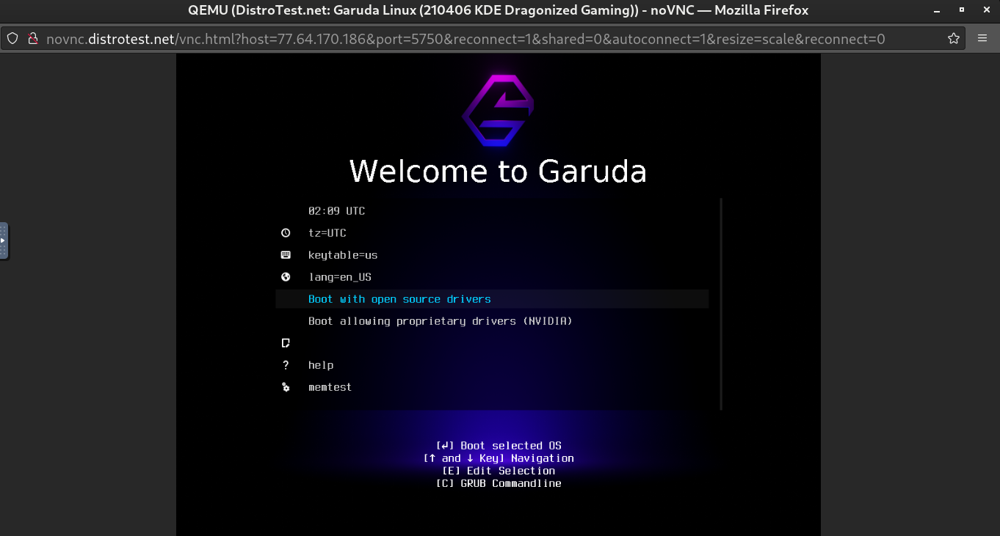
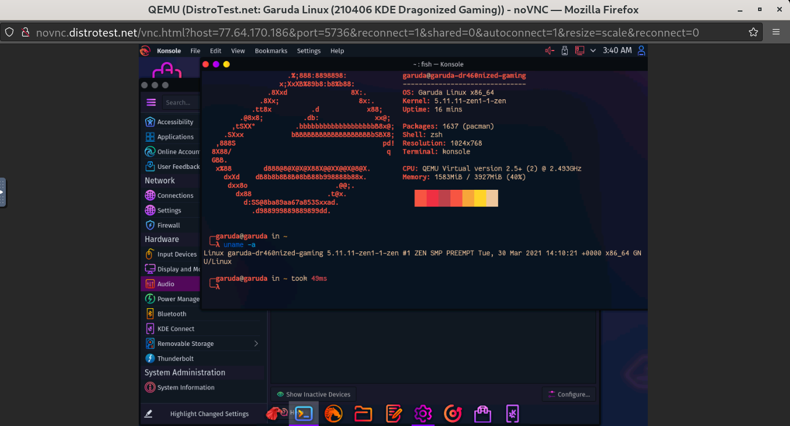

# Lab1 Exploring Linux Distributions

## Question 1
   
   1. What is the OS Type:**Linux**
   
2.  Which major distro is it based on?
    **Debian**
   
 3. Which processor architecture does it support?
   **armhf, ppc64el, riscv, s390x, x86_64**

 1. Is the distribution active or is it discontinued?
   **Active**
   
   1. What is the distro’s home page?
    **https://www.ubuntu.com/**

## Question 2

 1. What is the name of the distribution and the OS Type:
   **Distro Name: calculate Linux**
   **Os Type: Linux**
       
 2. Which major distro is it based on?

   **Gentoo**
       
    3. Which processor architecture does it support?

**Architecture: x86_64**

4. Is the distribution active or is it discontinued?

**Active**

    5. What is the distro’s home page?

**https://www.calculate-linux.org/**

## Question 3

 1. What is the name of the distribution?
   **Mx Linux**

 2. What is the country of Origin?

**Greece**

  3. What major distribution is it based on?
  
  **Base on:Debian (Stable), antiX**

 4. What is the distribution category?
   
**Desktop, From RAM, Live Medium, Raspberry Pi**

 5. Which processor architecture, aside from the one in the original query, does the OS support?
   
  **i686, x86_64** 

## Question 4
### A Linux Distribution used for data Rescue/Data recovery
| Distro Name |     Website                        | Desktop Enviroment | 
|-------------|------------------------------------|--------------------|
|**SystemRescue**|**http://www.system-rescue.org/**|  **Xfce**           |

### A Linux distribution used for Education that supports the ix86 processor architecture.

| Distro Name |     Website                        | Desktop Enviroment | 
|-------------|------------------------------------|--------------------|
|**Debian Edu/Skolelinux**|**http://www.skolelinux.org/**|**GNOME, KDE, LXDE, LXQt, MATE, Xfce**
||**https://blends.debian.org/edu/**  |                                  |

### A Linux distribution that supports the OEM installation method

| Distro Name |     Website                        | Desktop Enviroment | 
|-------------|------------------------------------|--------------------|
|**Pop!_OS**|**https://system76.com/pop**|**GNOME**|

## Question 5

**I chose Optimized  Gaming Operating System as a project waiting for evaluation is an excellent concept. However, it is still not very user-friendly to regular users, still charming if you consider that this distro automatically detects all the hardware. What is mounted by default, it sees it no matter what you have. Also, configure all the networks mounted in a distro based on Debian that looks like ubuntu. Hence, the ram consumption is super lovely to run anything in it super fast, but all the process takes a long time still is not well implemented, and buggy once is done runs super fast.**

## Question 6

