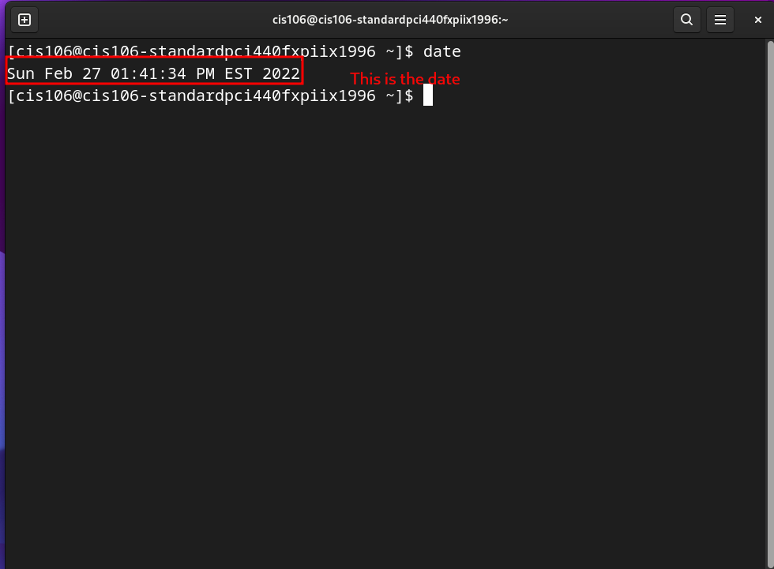
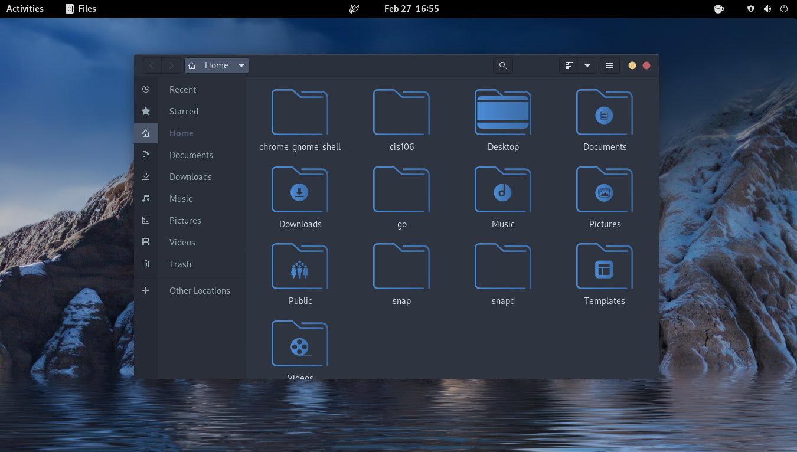
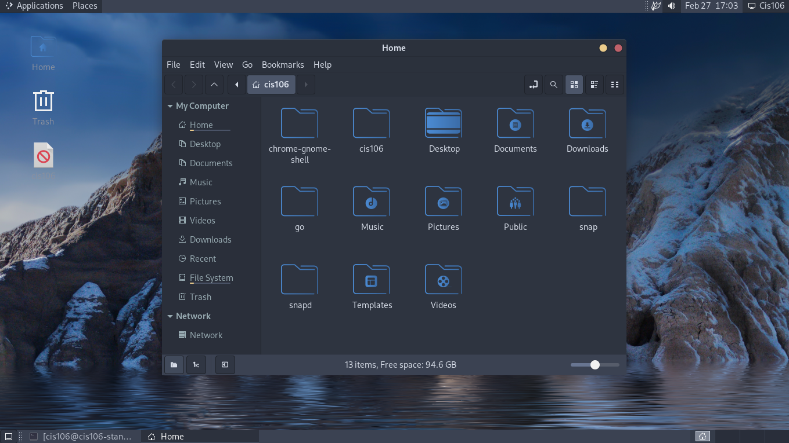

# Lab 3 Using Endeavour os

# Question 1

# Question 2

# Question 3

| Program purpose     | Package Name | Version | Description |
| ------------------- | ------------ | ------- | ----------- |
| Play a tetris game  | quadrapassel | 40.2-1  |Fit falling blocks together (Tetris-like game for GNOME)|             
| Play a video file   | vlc          | 3.0.16-8 | Multi-platform MPEG, VCD/DVD, and DivX player | 
| Browse the internet | firefox      | 97.0.1-1 |  Standalone web browser from mozilla.org             |
| Read your email     | gmail-desktop| 2.0.3|Gmail Desktop is a cross-platform dedicated Gmail app written in Electron. This app supports notifications, multiple accounts, default mailto handling, and more!|  
| Play music         |     vlc          | 3.0.16-8 | Multi-platform MPEG, VCD/DVD, and DivX player | |

Commands Answers:
* Sub question1: `sudo pacman -S firefox vlc quadrapassel`
  
* Sub question2: `sudo pacman -R firefox vlc quadrapassel`
  
* Sub question3: `sudo pacman -S vlc quadrapassel && sudo snap remove gmail-desktop && sudo pacman -R vlc firefox`

# Question 4

| command | what it does |
|---------|--------------|
| echo    | display a line of text|
| fortune | print a random, hopefully interesting, adage|
| cowsay  | configurable speaking/thinking cow (and a bit more)|
| lolcat  | rainbow coloring effect for text console display   |
| figlet  | display large characters made up of ordinary screen characters|
| toilet  | display large colourful characters|
| rig     | Random Identity Generator|

