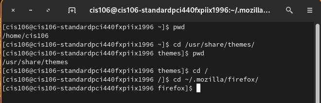
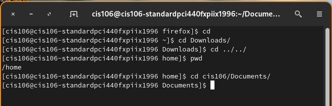
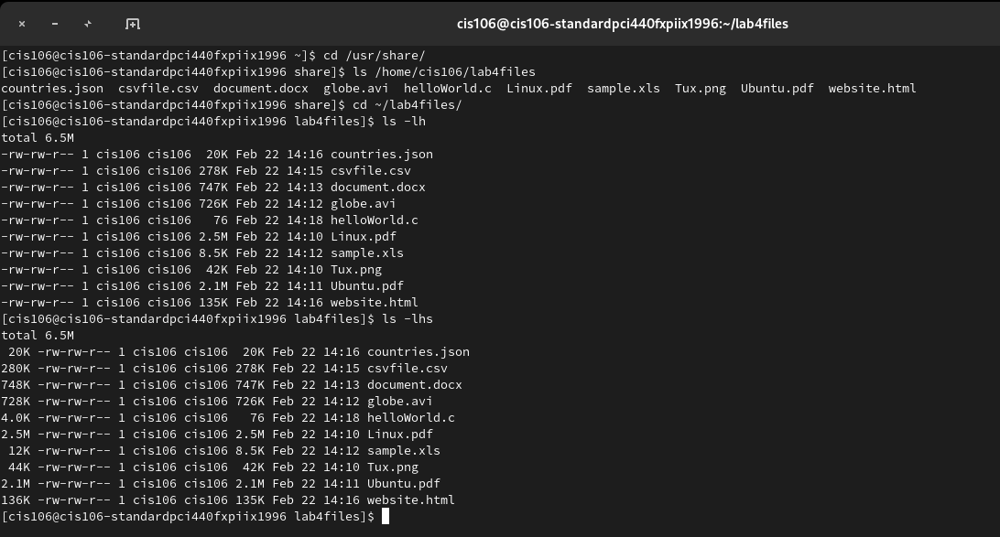
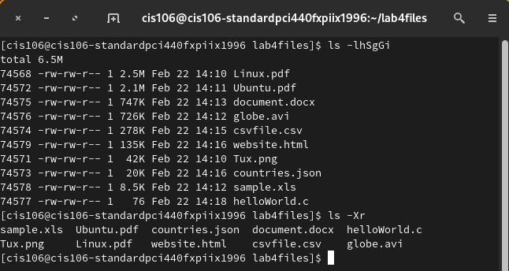
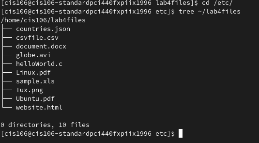
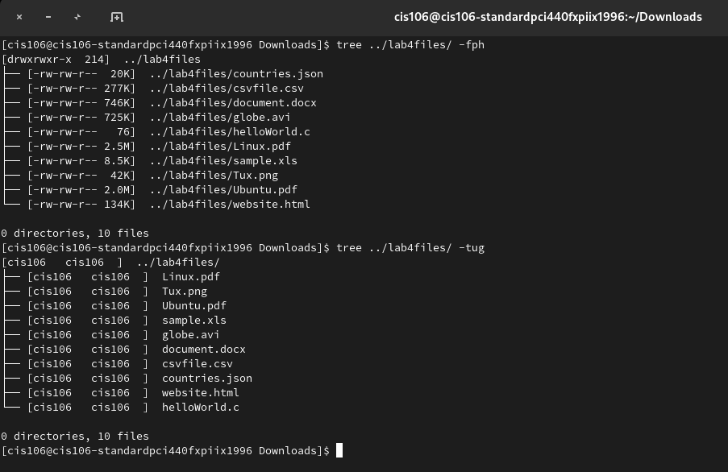
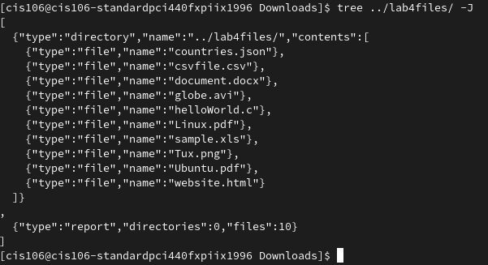
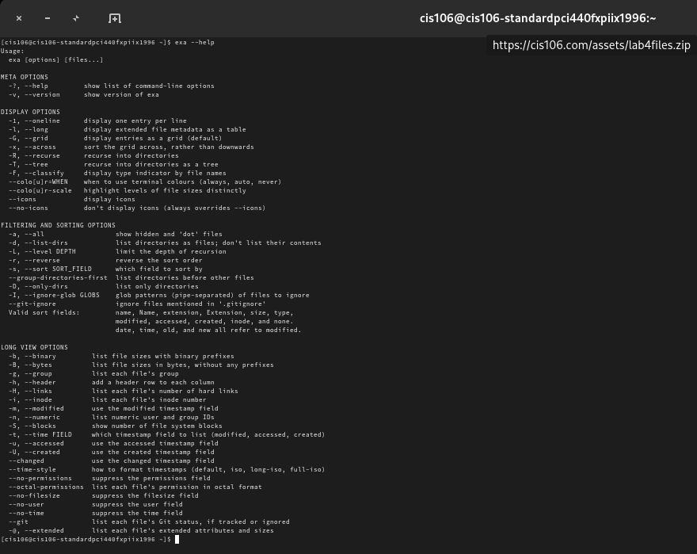
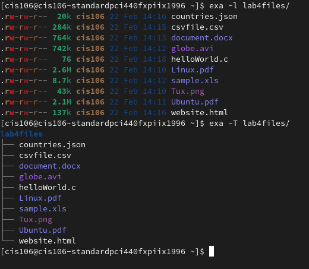
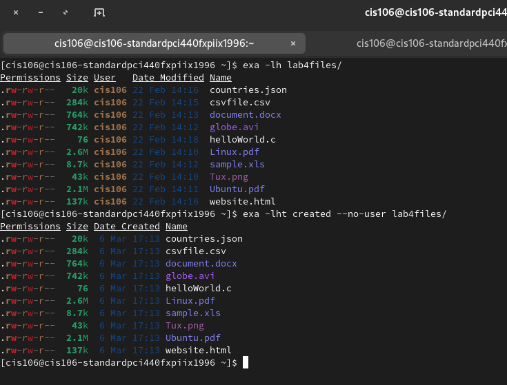

# Lab 4 The Linux fs

## Question 1
### Table 1

-----------------------------------

| Directory |          Function            
|-----------|---------------------|
|bin        |    bin is short for binary. It generally refers to the built applications  |
|dev        |  directory contains the special device files for all the devices. The device files are created during installation                   |
|etc        |   contain all your system configuration files in it                  |
|home       |  a directory for a particular user of the system and consists of individual files                   |
|media      |   This directory contains subdirectories which are used as mount points for removable media such as floppy disks, cdroms and zip disks                 |
|opt        |    The installation of add-on application software packages.                 |
|proc       |   contains a hierarchy of special files which represent the current state of the kernel                  |
|srv        |      contains site-specific data which is served by this system               |
|usr        |     consists of several subdirectories that contain additional UNIX commands and data files                |
|var        |    contains files to which the system writes data during the course of its operation                 |
-----------------------------------

### Table 2
---------------------------------------------

|Command |What it does 	|Syntax | Example|
|----------------|-----------------|----------------|-------------------|
|cd 	|change directory|cd directory_name| cd +Path |
|pdw 	|Print name of current/working |pwd + directory | pwd + L  | 
|ls 	|lists files and directories within the file system, and shows detailed information about them |ls + options | ls -ls|    

----------------------------------------------

## Question 2

## Question 3

 
 ## Question 4

 ## Question 5

 
 
 
