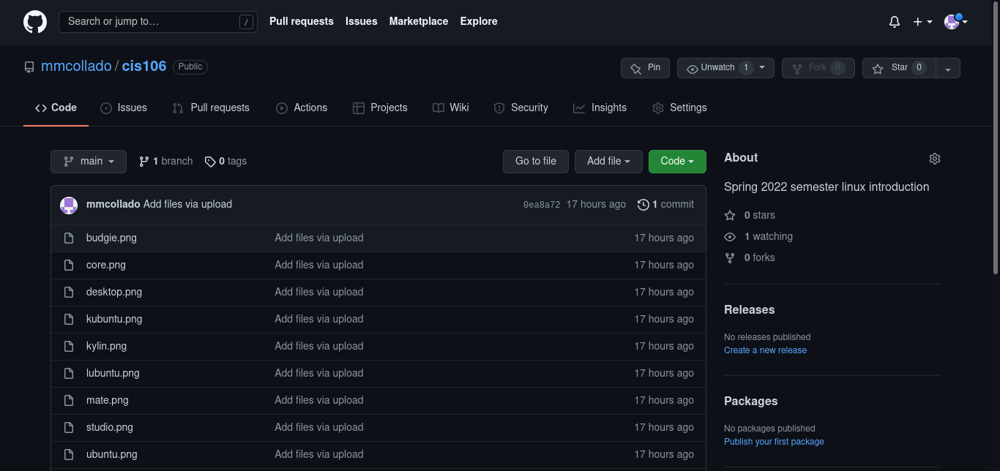
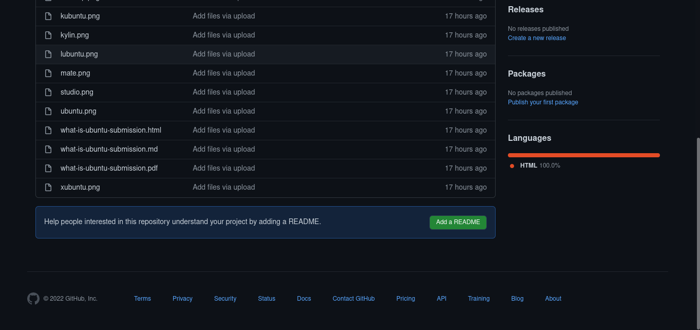

# Week Report 0
## Summary of Presentation: Introduction to CIS 106

Write your summary here

        Markdown and github

 Easy way to use and import any content to work with the program and github itself  

other thing I like about markdown and all the project we submit to git hub is the versatile of the use it has like no could imagine that this software is so easy to use.  

## My github account

## Final Project Research: Pick a project
Answer the question here

I Going to Make the Default Project

