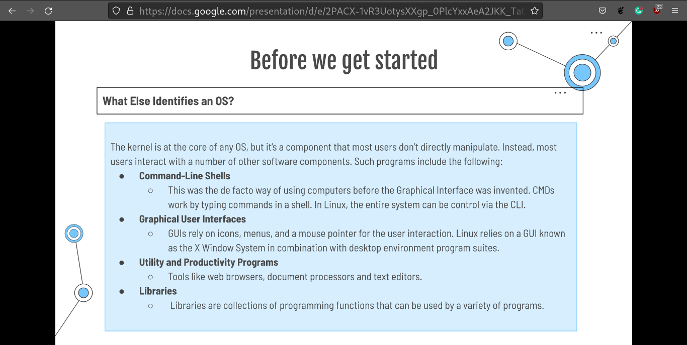
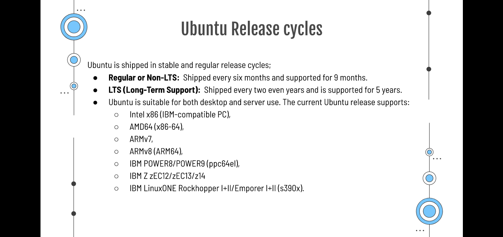
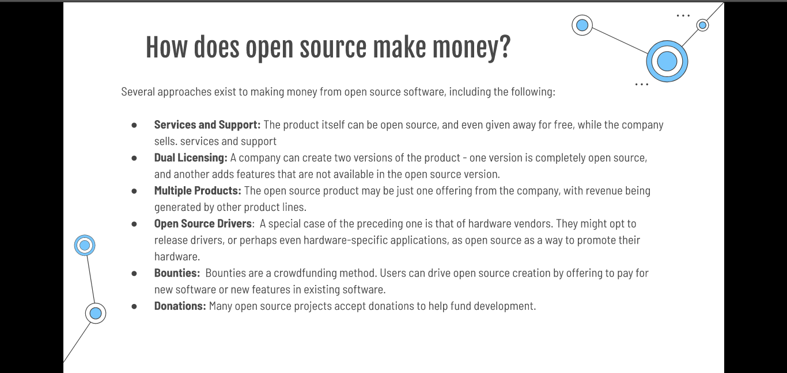

# Week Report 1
## Summary of Presentation: Introduction to Linux

* Operating system provides software features.
* Kernel is the low level software that communicates with the hardware and make any device works.

* There are 6 components in linux: Application,Graphical desktop, Daemon, shells, Linux Kernel and Hardware.

* Any os have command-Line Shells, Graphical user interfaces, Utility, Productivity Programs and Libraries.

* Linux is highly scalable and customizable.

* Linux can run on any device.

* Linux have the concept of Unix, but linux have more freedom.

* History of linux have change the way of all us people use a device. 

* Linux is free most of the case, but some have a cost to make support or because developers work in it as full time and do it for living.

* Software always have an alternative.

* Some hardware doesn't work well in linux such as nvidia graphics cars hybrid that. Usually have a problem with wayland, and updates that broke the kernel some times.

* Many Distro distributions but commonly Ubuntu, Fedora , Manjaro are the common ones.

*Different types of kernel and release circles.

* How open source make money.

## Final Project Research Questions and answers

1. What is Linux?
   **Linux is an operating system like any other as windows, or macos That control the a device that can be a computer a car or even a smart control for a house.**

   2.  What is a Linux distribution?
   
   **A linux distribution is a derivate os from any one that is made for example lubuntu is base on ubuntu the main os and use the same packet's system that is apt plus their own repositories**

     3. What is Endeavour os ?

**Endevour os is an operating system base in Arch linux that want to be the remplacement of antergos and be the closes to arch possible and is mean to the intermediate user of linux that need hands on get-go giving as a result a minimum amount of pre installed apps**

4.     Why I chose Endeavour os ?

  **Endeavor os is based in an arch. Also, I chose it because it has less bloatware and is not attached to pre-build configurations as many other arch based are. Another point is this os has an online installer. So you can use and choose what package to install and what desktop environment to change in minutes. This one also supports making a btrfs partition format that can be handy when you need to create a snapshot of your operating system and back up where you leave in case something goes wrong in a matter of 5 minutes or less. Another point is the community and well-documented wiki that explain almost everything you need to make the system run daily.**

5. What are the system requirements for installing Endeavour os:

* Processor minimum at least dual core processor for gaming and more you need at least a qual core

* Ram: 2 up to 4 for good user experience.

* Disk Space: 20gbs. 

