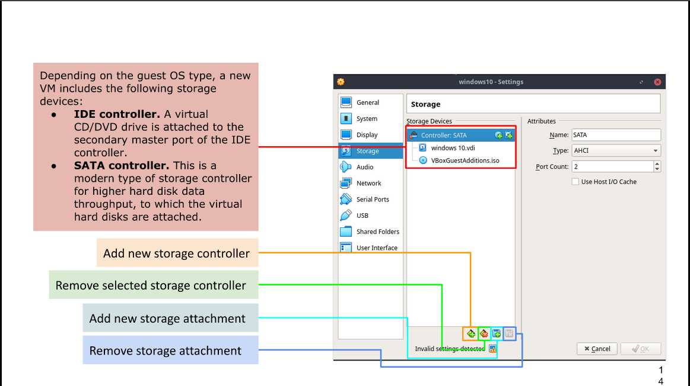

# Week Report 2

# The basic of virtualization

* Virtualization is basically recreate  hardware in a virtual environment.
* Different types of virtualization: Server-side virtualization anb client virtualization.

# Benefits of virtualization: 

* Allow running multiple machines on it.
* Reduce cost by reducing the physical hardware.
* Offers the capability of test without risk of malware of viruses.

# Installing ubuntu in virtual box

  

# What is raspberry pi 

* A super tiny computer with the potential of do anything you can imagine.

*  Raspberry pi can be use for education of adult and child's of computer science.

# Specs of PI 4:
  

  # MODELS OF RASPBERRY PI:
  
  * Raspberry Pi Zero
  * Raspberry Pi Zero WH
  * Raspberry Pi Zero W
  * Raspberry Pi 3 B+
  * Raspberry Pi 4B(2GB)
  * Raspberry Pi 4B(4GB)
  * Raspberry Pi 4B(8GB)
  
  # 5 Projects you can do with raspberry PI:

* 1. Replace Your Desktop PC With a Raspberry Pi
* 2. Cut the Cord With Kodi: A Raspberry Pi Media Center.
* 3. Build a Minecraft Game Server
* 4. Build a Stop Motion Camera
* 5. A Home Automation System With Arduino

