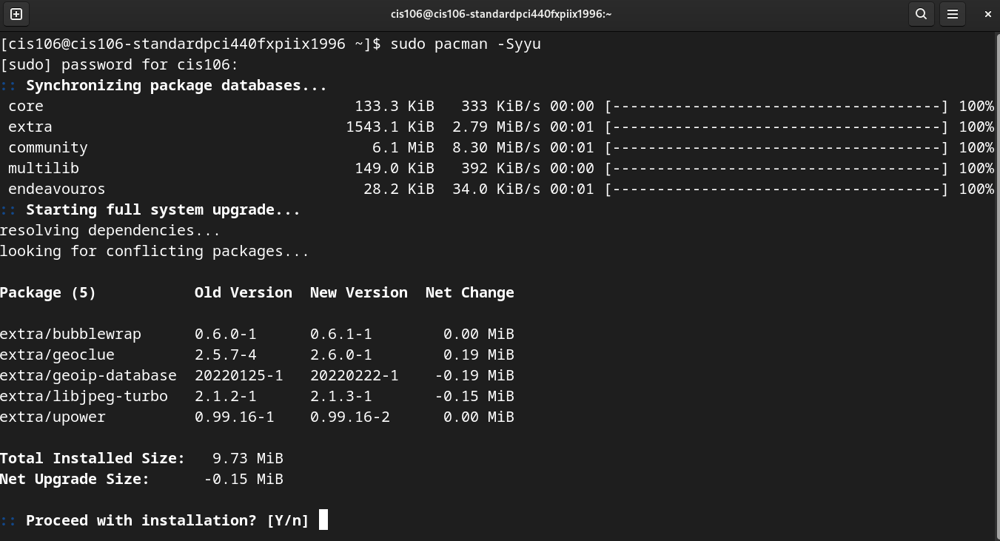

# Week Report 3
## Summary of Presentation: The History of Bash linux

#        Exploring Desktop Environments

* Gnome
* Mate
* Cinnamon
* Pantheon
* KDE
* BUDGIE
* Openbox
* Deeping DE
* XFCE
* LXDE
* LXQT
* FLUXBOX
  
  #          Definitions for the following terms: GUI, DE
 
 ## GUI:

* Graphical interfaces that allows users to interact with the computer in a more visual way  using icons, and others graphical effects. Aspects of the de to work as is intended.

## DE:

* is a desktop environment thats is implemented, and runs on the top of a gui using it as a layer for  abstraction level  making the user experience easier. 

# Bulleted list of the common elements of a desktop environment

* Desktop Settings
* Menu
* Display Manager
* File Manager
* Icons
* Favorites Bar
* Launcher
* Panels
* System Tray
* Widgets
* Window Manager
   
#  The bash Shell

##            What is a shell?

* to get it simply the shell is the program that takes the commands from keyboard, and gives them to the operating system to perform a task install a program or just  Download software.

## List different shells 

* Bourne shell(sh)
* GNU Bourne-Again sh
* C shell
* Korn shell(ksh)
* z shell

###  List some bash shortcuts (no more than 10 and no less than 5)

* Ctrl + A - go to the start of the command line.
  
* Ctrl + E  - go to the end of the command line.
  
* Alt  + C  - Capitalize to end of the word starting at cursor.
  
* Alt  + U  - make uppercase from cursor to the end of the word.
  
* Ctrl + F  - move forward one character.
  
  ####          List basic commands and their usage

* date  = Display the current date and time.
* cal   = Display a calendar of the current month.
* df    = Display the current amount of free space in our disk drives and time/
* free  = Display the amount of free memory.
* uname = Display information about your system.
* clear = Display the screen.

# Managing Software

## Command for updating Endeavor os
  
  ``` sudo pacman -Syyu ```




##   Command for installing software

``` sudo pacman -S name of the software ```


###            Command for removing software

 ```sudo pacman -R name of the sofware to remove```

 

###        Command for searching for software

``` sudo pacman -S name of the sofware```


####            Definition of the following terms:

#   Package

* is the compressed file archive of files that comes with a particular application any installations program can be package to certain distributions and configurations.

 ##               Library

* is a collection of pre compile pieces of code called functions. the library contains common functions and together, they form a package called library and usually the code reuses though the program. Using piece of code again in the program and saves time.
   
   ###             Repository

* is the location where something is found in significant quantities, and when the meaning is extended in computing is defined as a central location.
  

#    Include the screenshot of how to update ubuntu with its explanation (page 6)


In your repository create a folder for cheat sheets and place here the installing software cheat sheet, and markdown cheat sheet.